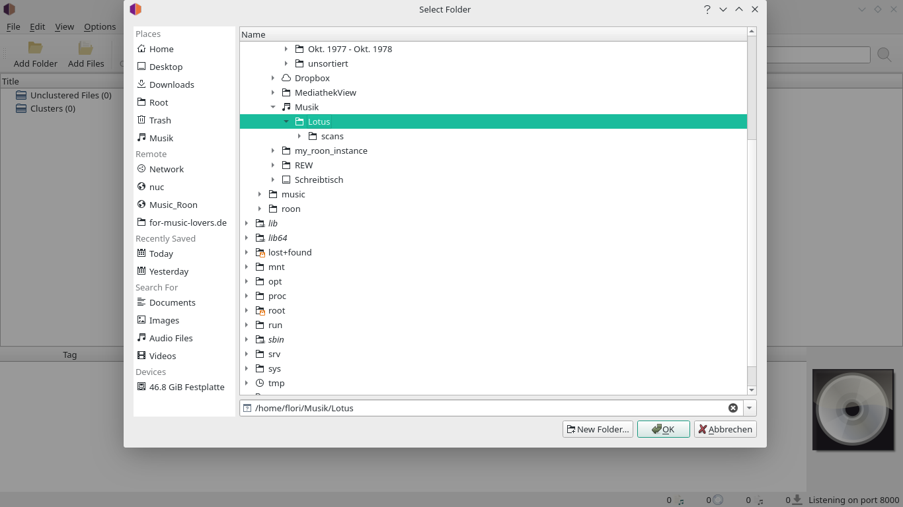
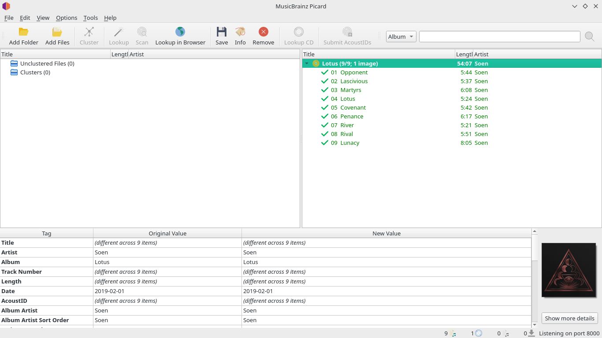
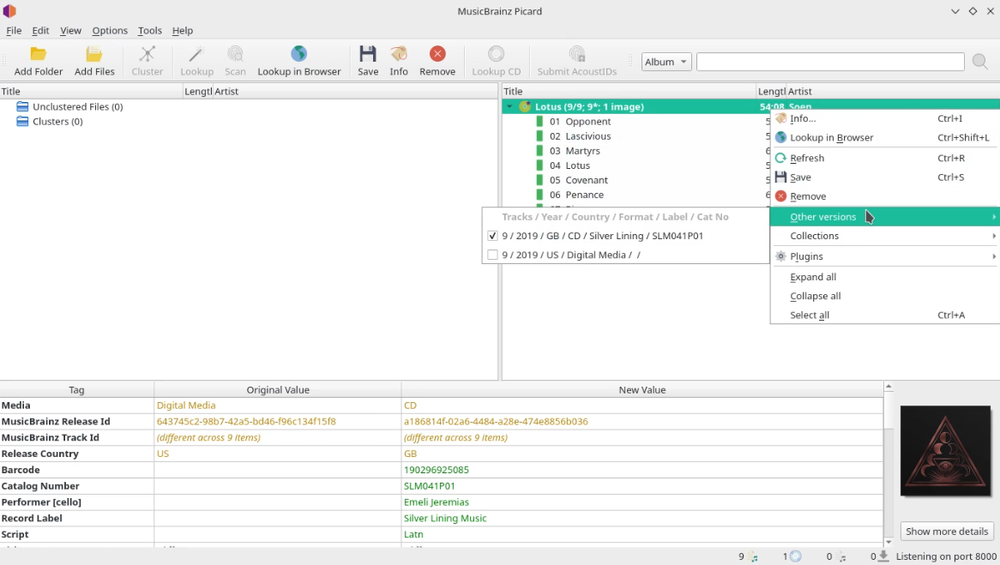
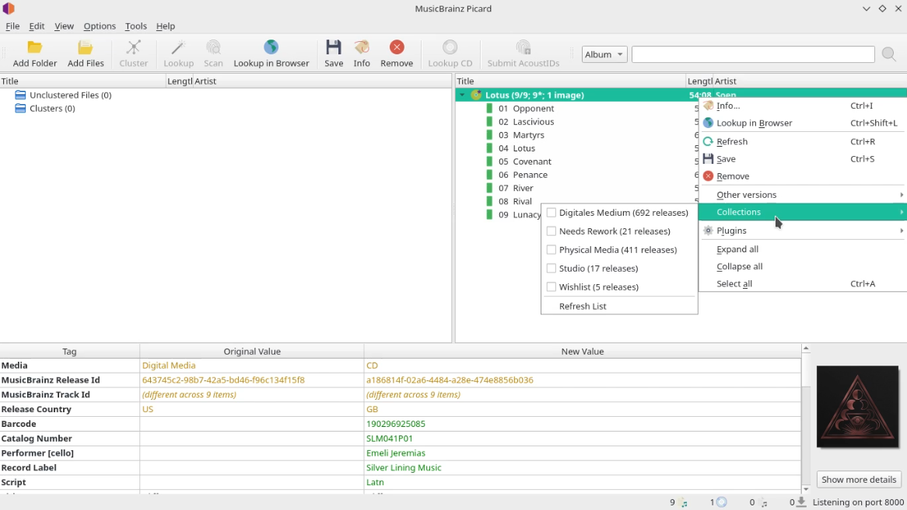
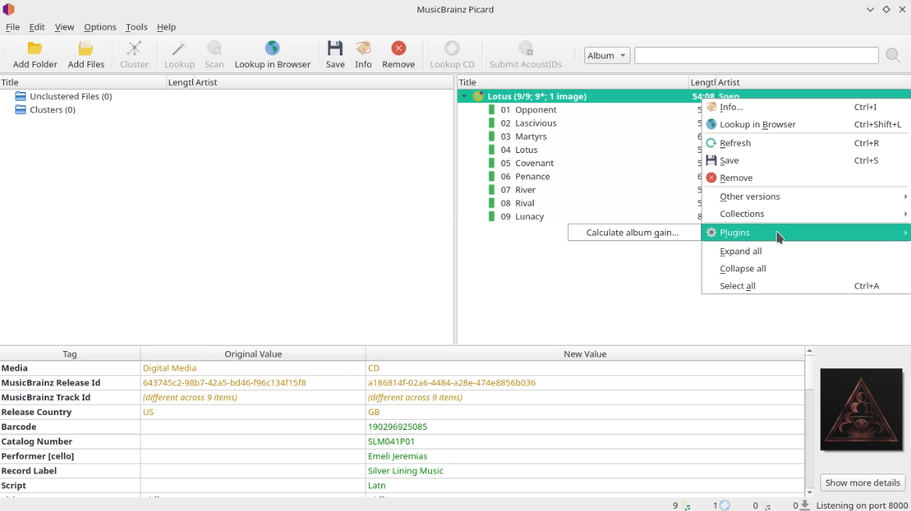

# My procedure of grooming my music collection

I would like to introduce my personal steps and considerations that I do before and after downloading music. This seems a bit complicated and of course much more time-consuming than other options, but has proven itself in the past for me.

Personally, I prefer <a href="local-files.md">local music files</a> over streaming because it has some advantages for me within Roon.

The first step is to search and compare at my prefered <a href="sources-for-downloadable-audio-files.md">sources for downloadable audio files</a> in the following aspects:

<ol>
<li>Highest Quality
<ol>
<li>Sometimes it is better to wait a while before buying a newly released album. In some cases an album is offered in CD quality and later in a higher quality.</li>
</ol>
</li>
<li>Lowest Price</li>
<li>Bonus Tracks</li>
<li>Remastered (is not always better than the original)</li>
</ol>

Now it's time for tagging the music files. It's not really necessary, because Roon already has a very good detection mechanism. However, I made the experience that the manual tagging partly brings better results. There is also the possibility to add an album that is not yet in the Musicbrainz database, so that it can be identified by Roon. Of course there is also the possibility to automate the tagging with a software like <a href="http://beets.io/">Beets</a>, but I do not know if this gives someone the possibility to add an album to the <a href="https://musicbrainz.org/">MusicBrainz</a> database. In addition, I think it's better if a person has spotted the data for an album.

1. Open MusicBrainz Picard and "Add Folder" of the album.

2. Select the album.

As you can see on the green hooks, this album is already identified, all file meta tags match the MusicBrainz database and it has an album cover.

If the album can't be found in the MusicBrainz database it's time to add it.

After adding an album you have to wait one minute or maybe a bit longer and then refresh. Now the album should be identified.

3. If already identified you can choose the album version, in case you are not happy with the result.

4. Add the album to a collection

5. Calculate album gain

During calculation, which can take some time, I search for <a href="https://for-music-lovers.de/admin/index.php?option=com_content&amp;view=article&amp;id=88&amp;catid=14">additional images and artwork</a>. Most download providers offer at least the front cover. Because that does not satisfy me, I try to get more pictures and possibly pictures in a better quality. Sometimes you even get a booklet in the form of a PDF file.

6. Save

