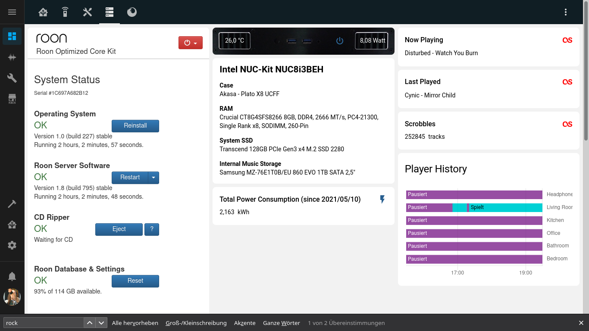

# Home Assistant Roon ROCK View



## Requirements
* [card-mod](https://github.com/thomasloven/lovelace-card-mod) (Custom CSS)
* [hass-simpleicons](https://github.com/vigonotion/hass-simpleicons)
* [lovelace-layout-card](https://github.com/thomasloven/lovelace-layout-card)
* [Roon Integration](https://www.home-assistant.io/integrations/roon/)

## Code

```
title: Home
views:
```

[...]

```
  - title: ROCK
    type: 'custom:masonry-layout'
    layout:
      width: 300
      max_cols: 3
    theme: Caule Light Blue
    icon: 'mdi:server'
    badges: []
    cards:
      - type: vertical-stack
        cards:
          - type: iframe
            url: 'http://rock'
            aspect_ratio: 350%
      - type: vertical-stack
        cards:
          - type: picture-elements
            elements:
              - type: icon
                tap_action:
                  action: toggle
                entity: switch.wake_on_lan
                name: WOL
                icon: 'mdi:power'
                theme: Caule Light Blue
                icon_height: 10px
                show_name: true
                show_state: true
                show_icon: true
                hold_action:
                  action: none
                style:
                  top: 50%
                  left: 70%
                  color: '#2c699e'
              - type: state-label
                entity: sensor.rock_temperature_sensor
                style:
                  top: 48%
                  left: 12%
                  color: white
              - type: state-label
                entity: sensor.rock_current_power
                style:
                  top: 48%
                  left: 88%
                  color: white
            image: /local/img/rock_akasa_case_front.jpg
          - type: markdown
            content: >-
              ## Intel NUC-Kit NUC8i3BEH


              **RAM**

              Crucial CT8G4SFS8266 8GB, DDR4, 2666 MT/s, PC4-21300, Single Rank
              x8, SODIMM, 260-Pin


              **System SSD**

              Transcend 128GB PCIe Gen3 x4 M.2 SSD 2280


              **Internal Music Storage**

              Samsung MZ-76E1T0B/EU 860 EVO 1TB SATA 2,5"
          - type: entity
            entity: sensor.rock_total_consumption
            name: Total Power Consumption (since 2021/05/10)
            style: |
              ha-card .header .name {
                --secondary-text-color: var(--primary-text-color);
              }
              ha-card .header .icon {
                color: #285f90;
              }
              ha-card .info .value, ha-card .info .measurement {
                font-size: 14px;
                color: black;
              }
      - type: vertical-stack
        cards:
          - type: entity
            entity: sensor.florib
            name: Now Playing
            icon: 'si:Last.fm'
            style: |
              ha-card .header .icon {
                color: red;
              }
              ha-card .header .name {
                --secondary-text-color: var(--primary-text-color);
              }
              ha-card .info .value {
                font-size: 14px;
              }
          - type: entity
            entity: sensor.florib
            attribute: last_played
            name: Last Played
            icon: 'si:Last.fm'
            style: |
              ha-card .header .icon {
                color: red;
              }
              ha-card .header .name {
                --secondary-text-color: var(--primary-text-color);
              }
              ha-card .info .value {
                font-size: 14px;
              }
          - type: entity
            entity: sensor.florib
            attribute: play_count
            name: Scrobbles
            unit: tracks
            icon: 'si:Last.fm'
            style: |
              ha-card .header .icon {
                color: red;
              }
              ha-card .header .name {
                --secondary-text-color: var(--primary-text-color);
              }
              ha-card .info .value {
                font-size: 14px;
              }
              ha-card .info .measurement {
                font-size: 14px;
                --secondary-text-color: var(--primary-text-color);
              }
      - type: history-graph
        entities:
          - entity: media_player.kopfhorer
            name: Headphone
          - entity: media_player.wohnzimmer_2
            name: Living Room
          - entity: media_player.kuche_2
            name: Kitchen
          - entity: media_player.buro_2
            name: Office
          - entity: media_player.bad_2
            name: Bathroom
          - entity: media_player.schlafzimmer_2
            name: Bedroom
        hours_to_show: 4
        refresh_interval: 0
 ```
 
 ## ToDo
 - [ ] Add Roon logo to Akasa case picture
 - [ ] Add state LED to Akasa case picture
 - [ ] Match the color of the font to the ROCK surface
 - [ ] Adjust font sizes to ROCK surface
 - [ ] Dark theme (iframe to match the ROCK surface)
 - [ ] Group related card elements
