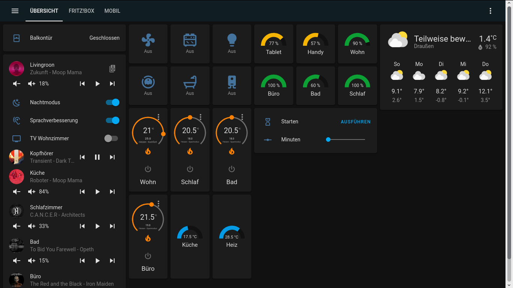
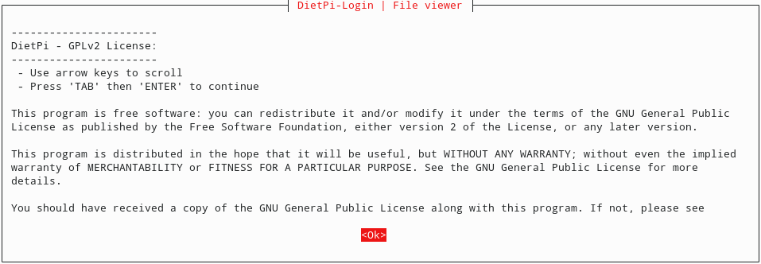
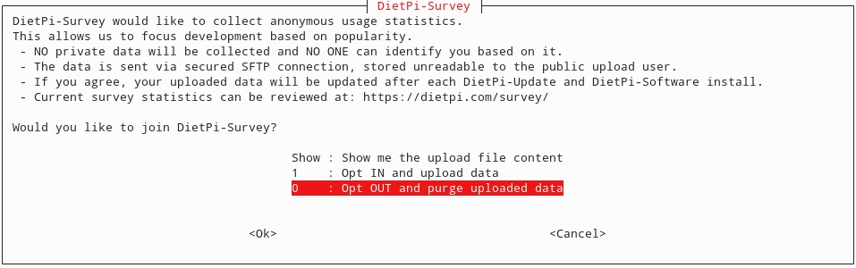
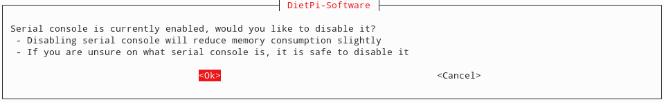
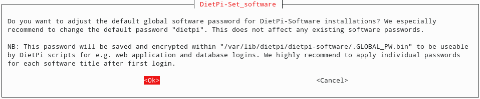
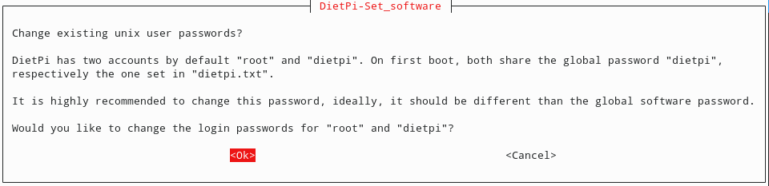
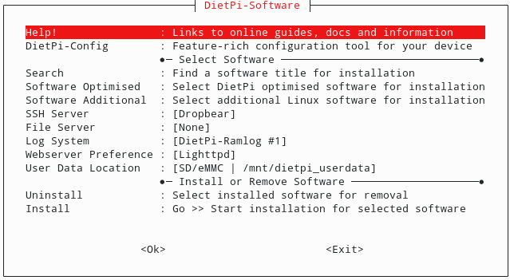
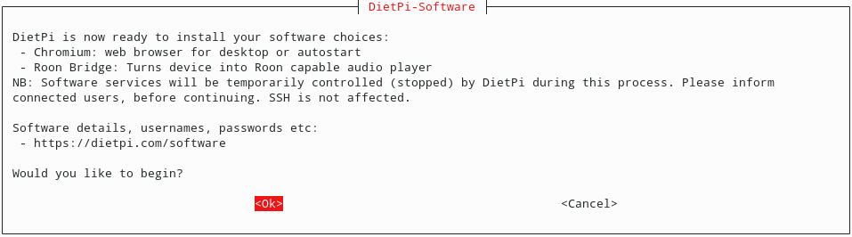
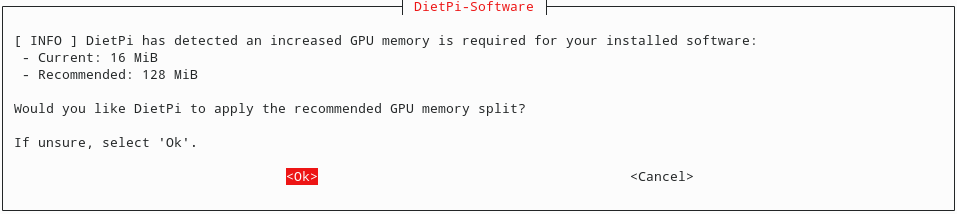

# My Smart Home project with Home Assistant

You can find some of my Home Assistant configuration files [here](https://github.com/florib779/homeassistant-config).

## Home Assistant Dashboard


## Integrated Roon Web Controller


## Goal

* Sonos
  - [x] Night mode (does not work when playing music via roon)
  - [x] Speech enhancement (does not work when playing music via roon)
  - [x] Speaker group management - [Mini Media Player](https://github.com/kalkih/mini-media-player) (Customizable media player card for Home Assistant Lovelace UI)
  - [ ] Control of subwoofer volume level
* Roon
  - [x] Control/Show info
    - [x] [RoonLabs music player](https://www.home-assistant.io/integrations/roon/) (Home Assistant integration)
    - [x] [Roon Web Controller](https://github.com/pluggemi/roon-web-controller) (Roon-Extension)
    - [x] [Mini Media Player](https://github.com/kalkih/mini-media-player) (Customizable media player card for Home Assistant Lovelace UI)
* TV
  - [x] Turn TV on - [Wake on LAN](https://www.home-assistant.io/integrations/wake_on_lan/)
  - [ ] Turn TV off
  - [ ] Control TV
    - [HDMI-CEC](https://www.home-assistant.io/integrations/hdmi_cec/)
    - [Android TV](https://www.home-assistant.io/integrations/androidtv/)
  - [ ] [Notifications for Android TV / FireTV ](https://www.home-assistant.io/integrations/nfandroidtv/)
* AVM FRITZ!DECT devices
  * Control
    - [x] Comet DECT (radiator control)
    - [x] FRITZ!DECT 200 (smart plug)
    - [x] FRITZ!DECT 210 (smart plug)
    - [x] FRITZ!DECT 300 (radiator control)
    - [ ] FRITZ!DECT 500 (LED light)
      - Actually not implemented in Home Assistant
  * Show info
    - [x] Comet DECT (radiator control)
    - [x] FRITZ!DECT 200 (smart plug)
    - [x] FRITZ!DECT 210 (smart plug)
    - [x] FRITZ!DECT 300 (radiator control)
    - [x] FRITZ!DECT 440 (switch with temperature sensor)
* Ecovacs Deebot
  - [x] Control
  - [x] Show info
- [x] Cooking Timer
- [ ] Report the amount of unread emails - [IMAP](https://www.home-assistant.io/integrations/imap/)

## Hardware

Raspberry Pi 3 Model B with [DietPi](https://github.com/MichaIng/DietPi) including [Roon Bridge](https://kb.roonlabs.com/RoonBridge), [Roon-Extension-Manager](https://github.com/TheAppgineer/roon-extension-manager), [Home Assistant](https://github.com/home-assistant) and display for Home Assistant.

## Installation

### Dietpi

[Diet-Pi-Installation-Extension-Manager](https://github.com/pluggemi/roon-web-controller/wiki/Diet-Pi-Installation-Extension-Manager)

After initial bootup, login through ssh.











Dietpi will update itself.

In my configuration I had to turn the display 180 degrees:

Dietpi-Config --> Display Options --> Rotation (LCD)

Additionally I dim the display a little bit:

Dietpi-Config --> Display Options -->Display Brightness

#### Additional software






1. As root, run the software configuration
  1. `dietpi-software`
2. Select Chromium and Roon Bridge
  1. Software Optimized -> Chromium
  2. Software Optimized -> Roon Bridge
3. Install the software, Dietpi-Config --> Install, then exit. The Raspberry Pi will reboot at this point.




Roon Bridge is now installed and running.

#### Console boot up

1. As root, run the autostart configuration:
  1.`dietpi-autostart`
2. Select Custom - `/var/lib/dietpi/dietpi-autostart/custom.sh`
3. Save and exit

#### System configuration

1. Modify the custom.sh startup script
  1. `nano /var/lib/dietpi/dietpi-autostart/custom.sh`
2. Add this to the bottom of the file:
```
# Run the custom kiosk script
xinit /root/kiosk.sh -- -nocursor
```
3. Save and exit
4. Make the custom.sh script executable
  1. `chmod +x /var/lib/dietpi/dietpi-autostart/custom.sh`
5. Create the kiosk.sh script
  1. `nano /root/kiosk.sh`
6. Paste the following code as content:

```
#######################################
#
# Start up script for running the
# Chromium web browser full screen
#
#######################################

# Set the X display
export DISPLAY=":0"
# Tune the screen blanking time - time in seconds (standby, suspend, off)
# All numbers are time in seconds
# default value
# xset dpms 600 600 600 &
# 1 minute blank time
xset dpms 60 60 60 &

# start full screen web app
# change the URL if Roon Web Controller is running on a different system
/usr/bin/chromium-browser --kiosk http://ip-of-the-homeassistant-server:8123
```

7. Save and exit
8. Make the kiosk.sh executable
  1. `chmod +x /root/kiosk.sh`
9. Reboot

### Home Assistant

Unfortunately, I had no luck installing Home Assistant via DietPi, so I decided on a Docker image.

<https://www.home-assistant.io/docs/installation/docker/>

`docker run --init -d --name="home-assistant" -v /mnt/dietpi_userdata/homeassistant/:/config -v /etc/localtime:/etc/localtime:ro --net=host --restart=always homeassistant/raspberrypi3-homeassistant:stable`

#### Updating the Docker image

`docker pull homeassistant/raspberrypi3-homeassistant:stable`  # if this returns "Image is up to date" then you can stop here

`docker stop home-assistant`  # stop the running container

`docker rm home-assistant`  # remove it from Docker's list of containers

`docker run --init -d --name="home-assistant" -v /mnt/dietpi_userdata/homeassistant/:/config -v /etc/localtime:/etc/localtime:ro --net=host --restart=always homeassistant/raspberrypi3-homeassistant:stable`  # finally, start a new one

## Links

* [DietPi installation](https://dietpi.com/phpbb/viewtopic.php?p=9#p9)
* [Installation of roon-extension-manager on DietPi](https://github.com/pluggemi/roon-web-controller/wiki/Diet-Pi-Installation-Extension-Manager)
* [Measurements: A look & listen to Roon Bridge](http://archimago.blogspot.com/2017/02/measurements-look-listen-to-roon-bridge.html)
