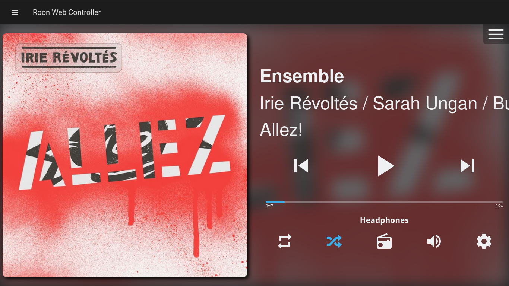

# My Smart Home project with Home Assistant

You can find some of my Home Assistant configuration files [here](https://github.com/florib779/homeassistant-config).

## Home Assistant Dashboard

## Integrated Roon Web Controller

## Goal

* Sonos
  - [x] Night mode (does not work when playing music via roon)
  - [x] Speech enhancement (does not work when playing music via roon)
  - [x] Speaker group management - [Mini Media Player](https://github.com/kalkih/mini-media-player) (Customizable media player card for Home Assistant Lovelace UI)
  - [ ] Control of subwoofer volume level
* Roon
  - [x] Control/Show info
    - [x] [RoonLabs music player](https://www.home-assistant.io/integrations/roon/) (Home Assistant integration)
    - [x] [Roon Web Controller](https://github.com/pluggemi/roon-web-controller) (Roon-Extension)
    - [x] [Mini Media Player](https://github.com/kalkih/mini-media-player) (Customizable media player card for Home Assistant Lovelace UI)
* TV
  - [x] Turn TV on - [Wake on LAN](https://www.home-assistant.io/integrations/wake_on_lan/)
  - [ ] Turn TV off
  - [ ] Control TV
    - [HDMI-CEC](https://www.home-assistant.io/integrations/hdmi_cec/)
    - [Android TV](https://www.home-assistant.io/integrations/androidtv/)
  - [ ] [Notifications for Android TV / FireTV ](https://www.home-assistant.io/integrations/nfandroidtv/)
* AVM FRITZ!DECT devices
  * Control
    - [x] Comet DECT (radiator control)
    - [x] FRITZ!DECT 200 (smart plug)
    - [x] FRITZ!DECT 210 (smart plug)
    - [x] FRITZ!DECT 300 (radiator control)
    - [ ] FRITZ!DECT 500 (LED light)
      - Actually not implemented in Home Assistant
  * Show info
    - [x] Comet DECT (radiator control)
    - [x] FRITZ!DECT 200 (smart plug)
    - [x] FRITZ!DECT 210 (smart plug)
    - [x] FRITZ!DECT 300 (radiator control)
    - [x] FRITZ!DECT 440 (switch with temperature sensor)
* Ecovacs Deebot
  - [x] Control
  - [x] Show info
- [x] Cooking Timer
- [ ] Report the amount of unread emails - [IMAP](https://www.home-assistant.io/integrations/imap/)

## Hardware

Raspberry Pi 3 Model B with [DietPi](https://github.com/MichaIng/DietPi) including [Roon Bridge](https://kb.roonlabs.com/RoonBridge), [Roon-Extension-Manager](https://github.com/TheAppgineer/roon-extension-manager), [Home Assistant](https://github.com/home-assistant) and display for Home Assistant.

## Installation

### Dietpi

Diet-Pi-Installation-Extension-Manager

After initial bootup, login through ssh.

Dietpi will update itself.

In my configuration I had to turn the display 180 degrees:

Dietpi-Config --> Display Options --> Rotation (LCD)

Additionally I dim the display a little bit:

Dietpi-Config --> Display Options -->Display Brightness

...

### Home Assistant

Unfortunately, I had no luck installing Home Assistant via DietPi, so I decided on a Docker image.

<https://www.home-assistant.io/docs/installation/docker/>

`docker run --init -d --name="home-assistant" -e "TZ=Europe/Berlin" -v /mnt/dietpi_userdata/homeassistant/:/config --net=host --restart=always homeassist
ant/raspberrypi3-homeassistant:stable`

### Updating the Docker image

`sudo docker pull homeassistant/home-assistant`
