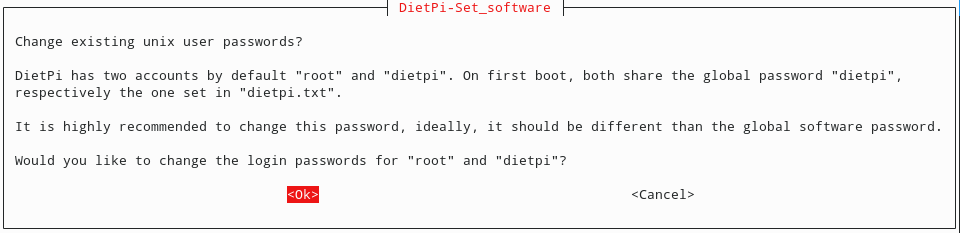
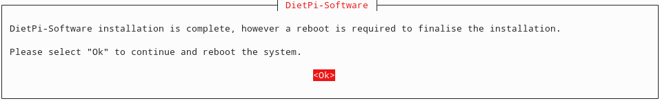

# RaspberryPi with Roon Bridge and display

## Hardware

Raspberry Pi 3 Model B with [DietPi](https://github.com/MichaIng/DietPi) including [Roon Bridge](https://kb.roonlabs.com/RoonBridge) and display for [my Home Assistant installation](home-assistant-smart-home.md).

## Installation

### Dietpi

After initial bootup, login through ssh: `ssh root@dietpi`

Password: `dietpi`


After confirmation Dietpi will update itself.





1. Select Software
  1. Software Optimized -> Chromium
  2. Software Optimized -> Roon Bridge
2. Install the software




#### Configure Sound Card

`dietpi-config`

Audio -> Soundcard -> hifiberry-digi


#### Rotate the display

In my configuration I had to rotate the display 180 degrees:

Dietpi-Config -> Display Options -> Rotation (LCD)

#### Console boot up

There's a way to configure DietPi to boot into a Chromium window. But with the following procedure you will get the following advantages:

* No cursor
* No scroll bar
* Turn your screen off after a given time
  * `rm /etc/X11/xorg.conf.d/98-dietpi-disable_dpms.conf`

1. As root, run the autostart configuration:
  1. `dietpi-autostart`
2. Select Custom - `/var/lib/dietpi/dietpi-autostart/custom.sh`
3. Save and exit

#### System configuration

1. Modify the `custom.sh` startup script
  1. `nano /var/lib/dietpi/dietpi-autostart/custom.sh`
2. Add this to the bottom of the file:
```
# Run the custom kiosk script
xinit /root/kiosk.sh -- -nocursor
```
3. Save and exit
4. Make the `custom.sh` script executable
  1. `chmod +x /var/lib/dietpi/dietpi-autostart/custom.sh`
5. Create the `kiosk.sh` script
  1. `nano /root/kiosk.sh`
6. Paste the following code as content:

```
#!/bin/sh

#######################################
#
# Start up script for running the
# Chromium web browser full screen
#
#######################################

# Set the X display
export DISPLAY=":0"
# Tune the screen blanking time - time in seconds (standby, suspend, off)
# All numbers are time in seconds
# default value
# xset dpms 600 600 600 &
# 1 minute blank time
xset dpms 60 60 60 &

# start full screen web app
# change the URL if Roon Web Controller is running on a different system
# set --user-data-dir to restore your login and Home Assistant settings
/usr/bin/chromium-browser --kiosk --user-data-dir=/root/.config/chromium http://ip-or-hostname:8123
```

7. Save and exit
8. Make the `kiosk.sh` executable
  1. `chmod +x /root/kiosk.sh`
9. `reboot`

[Source](https://github.com/pluggemi/roon-web-controller/wiki/Diet-Pi-Installation-Extension-Manager)

## ToDo
* Automatic system upgrade via [cron-apt](https://wiki.ubuntuusers.de/cron-apt/)
* Keep LEDs off
  * `nano /boot/config.txt`
    ```
    #--------Onboard LEDs--------
    # Disable the ACT LED
    dtparam=act_led_trigger=none
    dtparam=act_led_activelow=off
    
    # Disable the PWR LED
    dtparam=pwr_led_trigger=none
    dtparam=pwr_led_activelow=off
    ```
* Add virtual keyboard

## Links

* [DietPi installation](https://dietpi.com/phpbb/viewtopic.php?p=9#p9)
* [Measurements: A look & listen to Roon Bridge](http://archimago.blogspot.com/2017/02/measurements-look-listen-to-roon-bridge.html)
