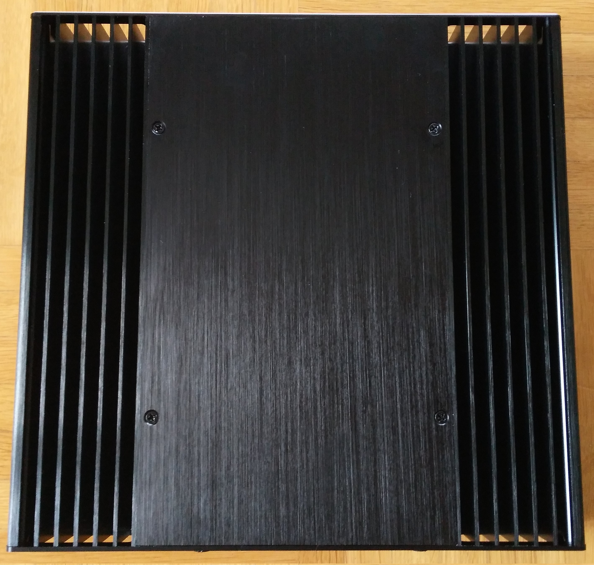

# My Roon ROCK project

## Hardware

At the time I've planned my [ROCK](https://help.roonlabs.com/portal/en/kb/articles/roon-optimized-core-kit) NUC my library was looking like this:

So I followed the recommendations in the Knowledge Base: [ROCK For Small to Medium Sized Libraries](https://help.roonlabs.com/portal/en/kb/articles/roon-optimized-core-kit#ROCK_For_Small_to_Medium-Sized_Libraries) (actually it's an Intel NUC 10).

1. Intel NUC Kit: NUC8i3BEH Mainboard (28 W, 32 GB, 38,4 GB/s, 32768 MB, Intel® NUC Kits, Intel® NUC Kit with 8th Generation Intel® CoreTM Processors) 
2. RAM: Crucial CT8G4SFS8266 8GB (DDR4, 2666 MT/s, PC4-21300, Single Rank x8, SODIMM, 260-Pin) 
3. System SSD: Transcend 128GB PCIe Gen3 x4 M.2 SSD 2280
4. Music SSD: Samsung MZ-76E1T0B/EU 860 EVO 1 TB SATA 2,5" internal

   

## Installation
### Update the BIOS

I decided not to update the bios to avoid unnecessary discrepancies. This does not seem to be necessary for newer NUCs, even if it is recommended in the Roon Knowledge Base.

According to the [changelog](https://downloadmirror.intel.com/29627/eng/BE_0081_ReleaseNotes.pdf) and [this post](https://community.roonlabs.com/t/keeping-intel-nuc-bios-updated-answered-no-need/37696/4), there is no need to update.

### Configure the BIOS

1. Boot the NUC and press F2 during startup to entire the BIOS configuration screen.
2. In the BIOS configuration screen, start by setting your BIOS to the factory defaults by pressing F9.
3. Set the proper Boot Settings (you may need to click "Advanced" first).
  1. Use Legacy, not UEFI.
  2. Set the boot order to boot from your SSD first.
  3. Disable Network Boot.
  4. Enable USB Boot but make sure the SSD has boot priority.
  5. You may need to enable the M.2 slot, depending on the BIOS version.
  6. Save your BIOS changes.

### Install ROCK

1. Turn off your NUC.
2. Unplug any USB storage you might have plugged into it. You can plug it back in after your install.
3. Insert the USB flash drive you prepared earlier into the front of the NUC.
4. Turn on the NUC and press the F10 key. Continue to hold the F10 key down until you appear at a menu that is asking you which device you'd like to boot from.
5. Select the USB flash drive.
6. Follow the instructions to install Roon OS. This procedure can take a few minutes, depending on the performance of your USB flash drive and the SSD to which you are installing.
7. Once it is done installing, unplug the USB flash drive and hit ENTER to reboot.
8. Your NUC should boot from the SSD, and a few seconds later, you should see a Roon message displaying the IP address of the NUC. Usually you can just use [http://rock](http://rock). This page should be entered in a web browser to complete the setup.

### Add Codecs

On ROCK [ffmpeg will be used for mp3 and aac decoding](https://community.roonlabs.com/t/codecs-ffmpeg-for-rock/117646/4) and [for parsing out stranger tags](https://community.roonlabs.com/t/codecs-ffmpeg-for-rock/117646/9).

Download the codec: [https://johnvansickle.com/ffmpeg/builds/ffmpeg-git-amd64-static.tar.xz](https://johnvansickle.com/ffmpeg/builds/ffmpeg-git-amd64-static.tar.xz)

Extract it. If this fails take a look at this FAQ: [https://www.johnvansickle.com/ffmpeg/faq](https://www.johnvansickle.com/ffmpeg/faq)

As a Linux user I had problems with permissions. I was able to copy the codec, but it was not recognized by ROCK. So I had to do the following steps, like [mentioned in this post](https://community.roonlabs.com/t/missing-codecs-after-installing-ffmpeg-with-linux/112754/4):

1. `sudo mount -t cifs //rock/Data -o vers=1.0 /mnt/`
2. `sudo cp ffmpeg /mnt/Codecs`

Then I immediately formatted the Internal Music Storage. [It’ll be EXT4](https://community.roonlabs.com/t/ext4fs-internal-drive-not-recognized/114963/4).

After a reboot the web UI should look like this:

## Restore the database

I create my database backups next to Dropbox on a USB stick for quick restoration.
I simply plugged this USB stick with the existing backups of my old Roon Core into the ROCK-NUC and restored the last backup.

## Transfer the music files

If you want to import music, connect to Roon OS's `/Data/Storage` directory, and copy your music over. Then, you can set up your watched folder by following [these instructions](https://help.roonlabs.com/portal/en/kb/articles/local-files).

### Mount storage locally

`sudo mount -t cifs //rock/Data /mnt/ -o username=guest,password=guest,vers=1.0`

[Fastest way to transfer music to Rock](https://community.roonlabs.com/t/fastest-way-to-transfer-music-to-rock/115035)

## Fanless case

After some weeks I decided to buy the Akasa - Plato X8 UCFF fanless case.

   

## HTTP commands

* Stop Core: [http://rock.local/1/stopsoftware](http://rock.local/1/stopsoftware)
* Start or Reboot Core: [http://rock.local/1/restartsoftware](http://rock.local/1/restartsoftware)
* Power-off ROCK: [http://rock.local/1/poweroff](http://rock.local/1/poweroff)
* Reboot ROCK: [http://rock.local/1/reboot](http://rock.local/1/reboot)

[https://community.roonlabs.com/t/start-stop-command-from-windows10/92890/2](https://community.roonlabs.com/t/start-stop-command-from-windows10/92890/2)

## Network reset on ROCK

Connect a USB keyboard and monitor to the HDMI of ROCK and type `resetnetwork`.
  
[https://community.roonlabs.com/t/howto-set-roon-rock-to-another-ip-range/122748/4](https://community.roonlabs.com/t/howto-set-roon-rock-to-another-ip-range/122748/4)

## Additional Information

ROCK currently seems to run with the Linux kernel version 5, as [mentioned here](https://community.roonlabs.com/t/linux-kernel-version-for-current-rock-release/115797/6).

## Tips

If you don't want to see the unused audio outputs of the Roon server anymore, simply disable them in the BIOS.

## Links

* [Roon Installation ROCK in deutscher Sprache (German)](https://community.roonlabs.com/t/roon-installation-rock-in-deutscher-sprache/69610)
* [Roon Rock on NUC8i3BEH - General Guidance and Comments](https://community.roonlabs.com/t/roon-rock-on-nuc8i3beh-general-guidance-and-comments/74252)
* [Newbie start-up essential tips](https://community.roonlabs.com/t/newbie-start-up-essential-tips/113126)
* [NUC auto-on after power loss](https://community.roonlabs.com/t/nuc-auto-on-after-power-loss/105702/3)
* [Roon Server power consumption](https://community.roonlabs.com/t/roon-server-power-consumption/104629/8)
* [Performance Matrix Roon Server](https://community.roonlabs.com/t/performance-matrix-roon-server/30338)
* [What is a linear power supply and what is it used for/advantages?](https://community.roonlabs.com/t/what-is-a-linear-power-supply-and-what-is-it-used-for-advantages/156916/20)
* [ROON ROCK with a linear power supply?](https://community.roonlabs.com/t/roon-rock-with-a-linear-power-supply/29838)
* [Roon Rock with Linear Power Supply, does it make sense?](https://community.roonlabs.com/t/roon-rock-with-linear-power-supply-does-it-make-sense/42209)
* [Linear Power Supply for NUC 8th Generation](https://community.roonlabs.com/t/linear-power-supply-for-nuc-8th-generation/96155)
* [Does ROCK use TRIM on USB SSDs?](https://community.roonlabs.com/t/does-rock-use-trim-on-usb-ssds/123452/3)
* [$700 DIY RoonROCK Audio Streamer (PDF)](https://stewartphotographic.com/DIY_Roon_ROCK_Streamer/DIY_Roon_Music_Streamer.pdf)
