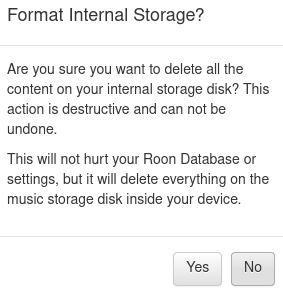

# My Roon ROCK project

[What is ROCK?](https://help.roonlabs.com/portal/en/kb/articles/roon-optimized-core-kit)

## Hardware

At the time I've planned my ROCK NUC my library was looking like this:

So I followed the recommendations in the Knowledge Base: [ROCK For Small to Medium Sized Libraries](https://help.roonlabs.com/portal/en/kb/articles/roon-optimized-core-kit#ROCK_For_Small_to_Medium-Sized_Libraries) (actually it's an Intel NUC 10 in the "old" Knowledge Base).

1. NUC8i3BEH
2. GB RAM
3. 128GB M.2 SSD
4. Additionally a 1TB SSD-drive for the music files

## Installation
### Update the BIOS

I decided not to update the bios to avoid unnecessary discrepancies. This does not seem to be necessary for newer NUCs, even if it is recommended in the Roon Knowledge Base.

According to the [changelog](https://downloadmirror.intel.com/29627/eng/BE_0081_ReleaseNotes.pdf) and [this post](https://community.roonlabs.com/t/keeping-intel-nuc-bios-updated-answered-no-need/37696/4), there is no need to update.

### Configure the BIOS

1. Boot the NUC and press F2 during startup to entire the BIOS configuration screen.
2. In the BIOS configuration screen, start by setting your BIOS to the factory defaults by pressing F9.
3. Set the proper Boot Settings (you may need to click "Advanced" first).
  1. Use Legacy, not UEFI.
  2. Set the boot order to boot from your SSD first.
  3. Disable Network Boot.
  4. Enable USB Boot but make sure the SSD has boot priority.
  5. You may need to enable the M.2 slot, depending on the BIOS version.
  6. Save your BIOS changes.

### Install ROCK

1. Turn off your NUC.
2. Unplug any USB storage you might have plugged into it. You can plug it back in after your install.
3. Insert the USB flash drive you prepared earlier into the front of the NUC.
4. Turn on the NUC and press the F10 key. Continue to hold the F10 key down until you appear at a menu that is asking you which device you'd like to boot from.
5. Select the USB flash drive.
6. Follow the instructions to install Roon OS. This procedure can take a few minutes, depending on the performance of your USB flash drive and the SSD to which you are installing.
7. Once it is done installing, unplug the USB flash drive and hit ENTER to reboot.
8. Your NUC should boot from the SSD, and a few seconds later, you should see a Roon message displaying the IP address of the NUC. Usually you can just use [http://rock](http://rock). This page should be entered in a web browser to complete the setup.

### Add Codecs

On ROCK [ffmpeg will be used for mp3 and aac decoding](https://community.roonlabs.com/t/codecs-ffmpeg-for-rock/117646/4) and [for parsing out stranger tags](https://community.roonlabs.com/t/codecs-ffmpeg-for-rock/117646/9).

Download the codec: [https://johnvansickle.com/ffmpeg/builds/ffmpeg-git-amd64-static.tar.xz](https://johnvansickle.com/ffmpeg/builds/ffmpeg-git-amd64-static.tar.xz)

Extract it. If this fails take a look at this FAQ: [https://www.johnvansickle.com/ffmpeg/faq](https://www.johnvansickle.com/ffmpeg/faq)

As a Linux user I had problems with permissions. I was able to copy the codec, but it was not recognized by ROCK. So I had to do the following steps, like [mentioned in this post](https://community.roonlabs.com/t/missing-codecs-after-installing-ffmpeg-with-linux/112754/4):

1. `sudo mount -t cifs //rock/Data -o vers=1.0 /mnt/`
2. `sudo cp ffmpeg /mnt/Codecs`

A reboot should make the codec should be available.

Then I immediately formatted the Internal Music Storage. [It’ll be EXT4](https://community.roonlabs.com/t/ext4fs-internal-drive-not-recognized/114963/4).

## Images

