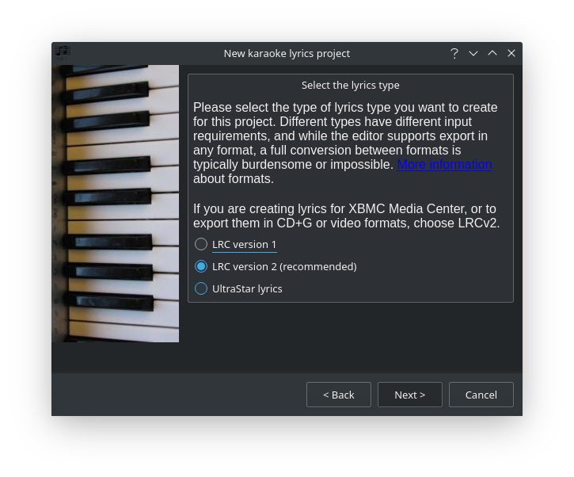
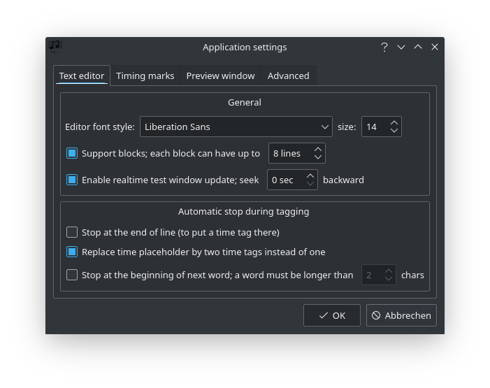
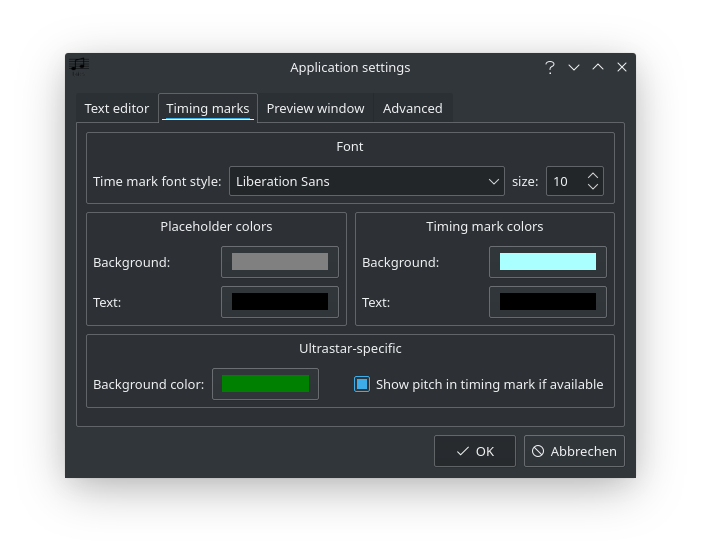
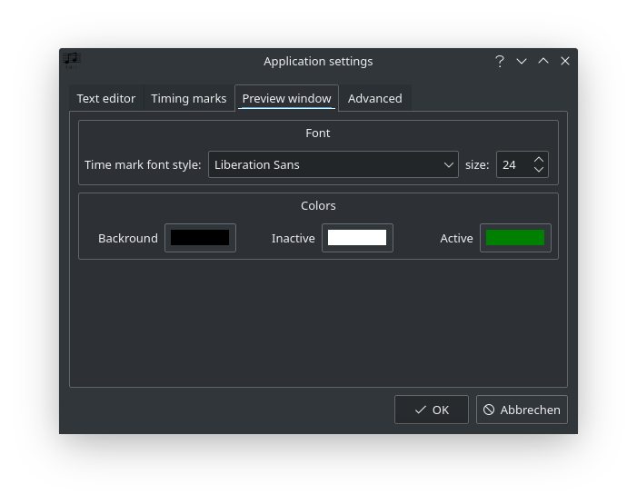
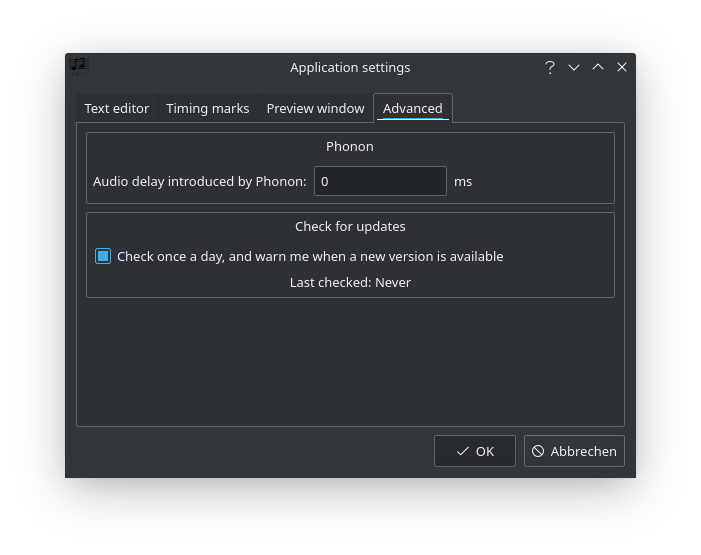

# Lyrics in Roon

It's now possible to read out unsynchronized as well as synchronized [lyrics](https://help.roonlabs.com/portal/en/kb/articles/lyrics) from file tags and display them in Roon. On the one hand in the graphical user interface of the software itself, and on the other hand via [display](https://help.roonlabs.com/portal/en/kb/articles/displays).

Although Roon already provides some lyrics (in my case about one third of my music collection), I add some from time to time, especially synchronized lyrics.

Before you start adding lyrics I'd recommend to read this [Lyrics Tag Guide](https://community.roonlabs.com/t/1-7-lyrics-tag-guide/85182).

## Karaoke Lyrics Editor

For editing and synchronizing lyrics I decided to use [Karaoke Lyrics Editor](https://www.ulduzsoft.com/linux/karaoke-lyrics-editor/), which is free, Open Source and available for Linux and Windows.

You can find more screenshots at the link above. I would like to limit myself here to more or less Roon-specific settings.

### New Project

### Settings

