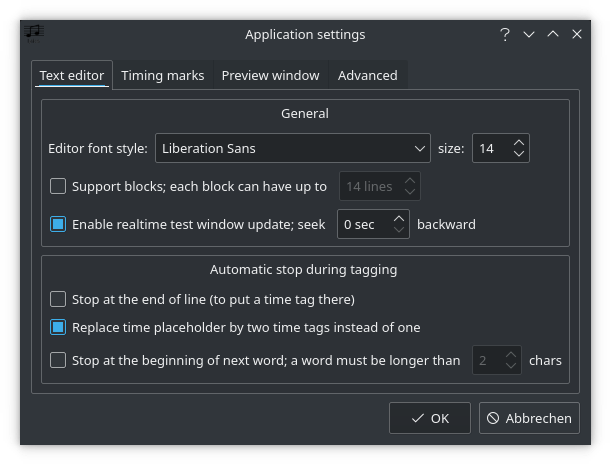

# Lyrics in Roon

It's now possible to read out unsynchronized as well as synchronized [lyrics](https://help.roonlabs.com/portal/en/kb/articles/lyrics) from file tags and display them in [Roon](https://roonlabs.com/r/n6HeIaGsYUKKh60AONYs5Q). On the one hand in the graphical user interface of the software itself, and on the other hand via [display](https://help.roonlabs.com/portal/en/kb/articles/displays). By the way, I modified my web display a little bit. More details [here](roon-web-display.md).

Although Roon already provides some lyrics (in my case about one third of my music collection), I add some from time to time, especially synchronized lyrics.

Before you start adding lyrics I'd recommend to read this [Lyrics Tag Guide](https://community.roonlabs.com/t/1-7-lyrics-tag-guide/85182).

## Karaoke Lyrics Editor

For editing and synchronizing lyrics I decided to use [Karaoke Lyrics Editor](https://www.ulduzsoft.com/linux/karaoke-lyrics-editor/), which is free, Open Source and available for Linux and Windows.

You can find more screenshots at the link above. I would like to limit myself here to more or less Roon-specific settings.

### New Project


### Settings




### Tips

* Blank lines are ignored by Roon
* If you want to have empty lines in the display, you have to insert a line with a timecode without following text.
  For Example:
  ```
  [01:30.67]Last line of chorus
  [00:32.54]
  [00:35.67]First line of verse
  ```
* If you want to test your synchronized lyrics within Karaoke Lyrics Editor, you have to insert temporary endmarks, which you have to remove before inserting the text into the file tags of your audio file.

## Other Tools

* [gImageReader](https://github.com/manisandro/gImageReader/) - A simple Gtk/Qt front-end to tesseract-ocr

## Links

* [How to report Incorrect lyrics?](https://community.roonlabs.com/t/how-to-report-incorrect-lyrics/65057)
