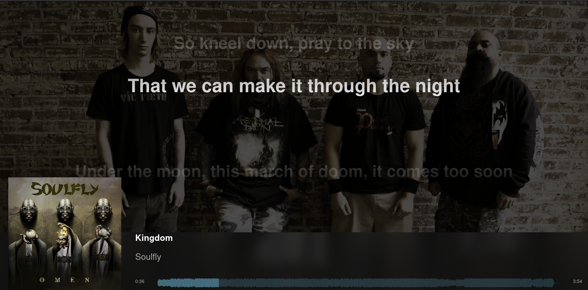

# Roon Web Display

Since [Roon](https://roonlabs.com/r/n6HeIaGsYUKKh60AONYs5Q) (Referral Link) Build 354 it's possible to [display Now Playing information and lyrics](https://help.roonlabs.com/portal/en/kb/articles/displays) in your webbrowser and Chromecast devices.

## FireTV devices

It's possible to display it on FireTV devices with Firefox and Silk.

To prevent the screen from shutting off after a while, I use the app [Fully Kiosk Browser](https://www.fully-kiosk.com/) on my Android tablet and FireTV (there are different apks available).

## My Modified Version

With Roon-Server installed you can modify the file `/RoonServer/Appliance/webroot/display_ui.html`.

Because i use [ROCK](https://help.roonlabs.com/portal/en/kb/articles/roon-optimized-core-kit) it is not possible to modify this file.

I'm using the browser extension [Stylus](https://github.com/openstyles/stylus/) where I can put [this CSS code](https://github.com/florib779/Modified-Roon-Web-Display/blob/main/Stylus.css) into without fiddling around with Roon server files, which are overwritten again when Roon is updated.

## Links

* [Customized Displays: OK to share?](https://community.roonlabs.com/t/customized-displays-ok-to-share/70903)
