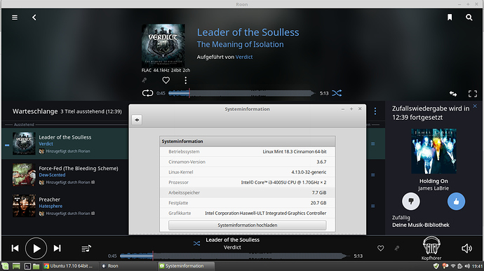

# Installing the Roon-Desktop-App on Linux with Wine



[Roon](https://roonlabs.com/) has no native Linux remote client yet, but I hope they will bring us one in the future. Nevertheless, there is a possibility to install it with the help of [Wine](https://www.winehq.org/) under Linux.

There are some advantages to installing the Windows version over installing it on portable Android or Apple devices:

* [Export](https://help.roonlabs.com/portal/en/kb/articles/export) your music files with the Roon provided metadata (which I need for my car or smartphone)
  * It happens to me that when exporting to a directory that already contains files from a previous export, the temp folder of Wine runs full. If your hard drive is not big enough, the worst-case scenario is that the system freezes or Roon crashes.
* Export your music library to an excel file
* Adding convolution files
* Editing with keyboard and mouse (no tipping on touchscreen), which I think it’s more comfortable
* Bigger Screen
* Roon UI runs smoother in most ways
* Of course it's possible to use [Windows Keyboard Shortcuts](https://help.roonlabs.com/portal/en/kb/articles/keyboard-shortcuts#Windows_Keyboard_Shortcuts)

After the installation you should have a working Roon remote, server and endpoint. The main interest would be the remote (I think most Roon users will run a separate Roon core). Server and endpoint of the full version are not tested yet, but should also work.

See also Roon for TV. In this project I installed the Roon desktop app using Wine and also the native Linux version of the roon server.

## Automated installation

The easiest way is to use this script [Roon-on-wine](https://github.com/RoPieee/roon-on-wine) that automates the installation process. This should be superfluous instructions below. Using the script you’ll see a lot of warning messages, which you can ignore.

Nevertheless I show you the manual installation and possible problems.

This process can take 30 minutes or longer (depending on your system).

There was already the idea to create a Snap or Flatpak file to simplify the installation even more. See [Roon UI on Wine as Linux snap?](https://community.roonlabs.com/t/roon-ui-on-wine-as-linux-snap/69425) So far there are no results in this area.

## Common Problems


### Roon no longer starts after an update of the roon app

It often happens that the program shortcuts on the Linux desktop no longer work after an update and therefore roon can no longer be started.
For this reason, it makes sense to use the `start_my_roon_instance.sh` script which was created during installation in your home folder or modify your shortcut as follows:

```env WINEPREFIX="/home/user/my_roon_instance" wine /home/user/my_roon_instance/drive_c/users/user/Local Settings/Application Data/Roon/Application/Roon.exe```

### "This application could not be started" after updating wine


Just ignore this message and hit no (Nein).

### Roon won't start after updating wine

Maybe you will be able to downgrade to an older version of wine.

In my case on Manjaro/Arch Linux I was able to do this by executing the following line in a terminal:

```sudo pacman -U /var/cache/pacman/pkg/package-old_version.pkg.tar.xz```

## Manual installation

This instructions were tested under the following distributions:

* Arch Linux LXDE desktop / Manjaro KDE desktop (32 bit)
* Debian Buster XFCE 4.12 desktop
* Fedora 27 Gnome desktop
* Ubuntu/Linux Mint 18.3 Cinnamon desktop (Roon 64 bit)
* Ubuntu/Linux Mint 18.3 Cinnamon desktop (Roon 32 bit)
* OpenSuse (Roon 32/64 bit)

## General notes

* Thanks to evand who added the Arch Linux instructions (which I adjusted a bit to make the document more consistent).
* Roon requires OpenGL 3.0 to run the remote ui. Maybe you have to install some graphic drivers.
* `~` is your user (home) directory. All code lines (except those to start the program and the menu entry) in this document should work without any modifications. If not replace `~` with `/home/user`, while "user" stands for your username.
* Uninstall all previous versions of Wine and any packages depend on it. Also delete or rename your wine folder if exists: `~/.wine` (should not be really necessary, because you will create a new wine folder).

Optionally you can add a scalefactor for high resolution screens:

```
#!/bin/bash

PREFIX=/home/user/my_roon_instance

env WINEPREFIX=/home/user/my_roon_instance wine /home/user/my_roon_instance/'drive_c/users/user/Local Settings/Application Data/Roon/Application/Roon.exe' -scalefactor=2
```

## Instructions for Arch based distributions

1. Ensure 32 bit libraries are enabled:
   * [https://wiki.archlinux.org/index.php/multilib](https://wiki.archlinux.org/index.php/multilib)
2. Create the Wine instance:
   * `env WINEPREFIX=~/WinRoon WINEARCH=win32 wine wineboot`
3. Set the Windows version to Windows 7:
   * `env WINEPREFIX=~/WinRoon winecfg`
4. Install .Net 4.5:
   * `env WINEPREFIX=~/WinRoon winetricks dotnet45`
5. Install Roon (previously downloaded)
   * `env WINEPREFIX=~/WinRoon wine ~/Downloads/RoonInstaller.exe`
6. To run it use the following (replace user with your user name)
   * `env WINEPREFIX=~/WinRoon/ wine ~/WinRoon/drive_c/users/user/Local\ Settings/Application\ Data/Roon/Application/Roon.exe`
