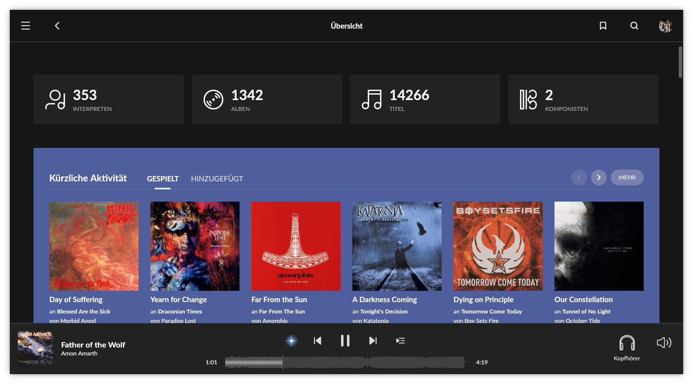
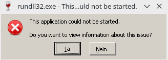
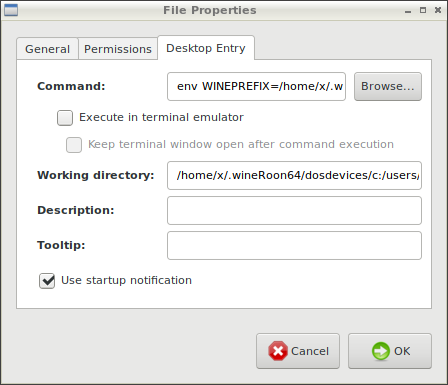

# Installing the Roon-Desktop-App on Linux with Wine



[Roon](https://roonlabs.com/) has no native Linux remote client yet, but I hope they will bring us one in the future. Nevertheless, there is a possibility to install it with the help of [Wine](https://www.winehq.org/) under Linux.

There are some advantages to installing the Windows version over installing it on portable Android or Apple devices:

* [Export](https://help.roonlabs.com/portal/en/kb/articles/export) your music files with the Roon provided metadata (which I need for my car or smartphone)
  * It happens to me that when exporting to a directory that already contains files from a previous export, the temp folder of Wine runs full. If your hard drive is not big enough, the worst-case scenario is that the system freezes or Roon crashes.
* Export your music library to an excel file
* Adding convolution files
* Editing with keyboard and mouse (no tipping on touchscreen), which I think it’s more comfortable
* Bigger Screen
* Roon UI runs smoother in most ways
* Of course it's possible to use [Windows Keyboard Shortcuts](https://help.roonlabs.com/portal/en/kb/articles/keyboard-shortcuts#Windows_Keyboard_Shortcuts)

After the installation you should have a working Roon remote, server and endpoint. The main interest would be the remote (I think most Roon users will run a separate Roon core). Server and endpoint of the full version are not tested yet, but should also work.

See also Roon for TV. In this project I installed the Roon desktop app using Wine and also the native Linux version of the roon server.

## Automated installation

The easiest way is to use this script [Roon-on-wine](https://github.com/RoPieee/roon-on-wine) that automates the installation process. This should be superfluous instructions below. Using the script you’ll see a lot of warning messages, which you can ignore.

Nevertheless I show you the manual installation and possible problems.

This process can take 30 minutes or longer (depending on your system).

There was already the [idea to create a Snap or Flatpak file](https://community.roonlabs.com/t/roon-ui-on-wine-as-linux-snap/69425) to simplify the installation even more.

Also take a look at this experimental flatpak file: https://github.com/RoPieee/roon-in-flatpak

## Common Problems

### Roon no longer starts after an update of the roon app

It often happens that the program shortcuts on the Linux desktop no longer work after an update and therefore roon can no longer be started.
For this reason, it makes sense to use the `start_my_roon_instance.sh` script which was created during installation in your home folder or modify your shortcut as follows:

`sh ~/start_my_roon_instance.sh`

My complete `~/local/share/applications/Roon.desktop` shortcut:

```
[Desktop Entry]
Comment=
Exec=sh ~/start_my_roon_instance.sh
Icon=93CE_Roon.0
Name=Roon
NoDisplay=false
Path[$e]=
StartupNotify=false
Terminal=0
TerminalOptions=
Type=Application
X-KDE-SubstituteUID=false
X-KDE-Username=
```

### "Your screen resolution is too small to run Roon. Please try to run maximized or full screen"

I had to experiment a bit with the `scalefactor` in the `start_my_roon_instance.sh` script. In order for it to finally work for me, I had to comment out some lines (**not** `#!/bin/bash`!):

```
#!/bin/bash

#SET_SCALEFACTOR=1

PREFIX=/home/flori/my_roon_instance
#if [ 1 -eq 1 ]
#then
#   env WINEPREFIX=/home/flori/my_roon_instance wine /home/flori/my_roon_instance/'drive_c/users/flori/Local Settings/Application Data/Roon/Application/Roon.exe' -scalefactor=2
#else
   env WINEPREFIX=/home/flori/my_roon_instance wine /home/flori/my_roon_instance/'drive_c/users/flori/Local Settings/Application Data/Roon/Application/Roon.exe'
fi
```

### "This application could not be started" after updating Wine



Just ignore this message and hit no (Nein).

### Roon won't start after updating Wine

Maybe you will be able to downgrade to an older version of Wine.

In my case on Manjaro/Arch Linux I was able to do this by executing the following line in a terminal:

```sudo pacman -U /var/cache/pacman/pkg/package-old_version.pkg.tar.xz```

See also: https://forum.winehq.org/viewtopic.php?f=8&t=34234

## Manual installation

This instructions were tested under the following distributions:

* Arch Linux LXDE desktop / Manjaro KDE desktop (32 bit)
* Debian Buster XFCE 4.12 desktop
* Fedora 27 Gnome desktop
* Ubuntu/Linux Mint 18.3 Cinnamon desktop (Roon 64 bit)
* Ubuntu/Linux Mint 18.3 Cinnamon desktop (Roon 32 bit)
* OpenSuse (Roon 32/64 bit)

### General notes

* Thanks to evand who added the Arch Linux instructions (which I adjusted a bit to make the document more consistent).
* Roon requires OpenGL 3.0 to run the remote ui. Maybe you have to install some graphic drivers.
* `~` is your user (home) directory. All code lines (except those to start the program and the menu entry) in this document should work without any modifications. If not replace `~` with `/home/user`, while "user" stands for your username.
* Uninstall all previous versions of Wine and any packages depend on it. Also delete or rename your Wine folder (in the following text "bottle") if exists: `~/.wine` (should not be really necessary, because you will create a new Wine bottle).

### Instructions for Arch based distributions

1. Ensure 32 bit libraries are enabled:
  * [https://wiki.archlinux.org/index.php/multilib](https://wiki.archlinux.org/index.php/multilib)
2. Create the Wine instance:
  * `env WINEPREFIX=~/WinRoon WINEARCH=win32 wine wineboot`
3. Set the Windows version to Windows 7:
  * `env WINEPREFIX=~/WinRoon winecfg`
4. Install .Net 4.5:
  * `env WINEPREFIX=~/WinRoon winetricks dotnet45`
5. Install Roon (previously downloaded)
  * `env WINEPREFIX=~/WinRoon wine ~/Downloads/RoonInstaller.exe`
6. To run it use the following (replace user with your user name)
  * `env WINEPREFIX=~/WinRoon/ wine ~/WinRoon/drive_c/users/user/Local\ Settings/Application\ Data/Roon/Application/Roon.exe`

To launch it via Roon's desktop icon right click on it and paste in the above line in the Command entry dialogue (see screenshot below):



### Instructions for Ubuntu based distributions (Roon 64 bit)

The following instructions are for Ubuntu based distributions only (Debian could be working too).

1. If your system is 64 bit, enable 32 bit architecture:
  * `sudo dpkg --add-architecture i386`
2. Install the Wine repository:
  1. `wget -nc https://dl.winehq.org/wine-builds/Release.key`
  2. `sudo apt-key add Release.key`
  3. `sudo apt-add-repository 'deb https://dl.winehq.org/wine-builds/ubuntu/ xenial main'`
     * "xenial" is the Ubuntu distribution release. Could be something else. Here is a list of other releases: [https://wiki.ubuntu.com/Releases](https://wiki.ubuntu.com/Releases)
3. Refresh your package cache:
  * `sudo apt update`
4. Install [Wine](https://www.winehq.org/) and [Winetricks](https://github.com/Winetricks/winetricks):
 1. `sudo apt-get install --install-recommends winehq-devel`
 2. `sudo wget http://winetricks.org/winetricks -O /usr/bin/winetricks`
  * This command will overwrite your existing Winetricks. Most distributions provide an older version of Winetricks, which will not work. If you update Winetricks with your package manager in the future, this update will overwrite your manually added Winetricks.
5. Create a new Wine directory (especially for Roon):
  * `env WINEPREFIX=~/WinRoon WINEARCH=win64 wine wineboot`
6. Open the configuration of Wine and choose "Windows 7":
  * `env WINEPREFIX=~/WinRoon winecfg`
7. [Download](https://roonlabs.com/downloads) Roon for Windows 64 bit.
8. Choose your created Wine environment and install Roon from your download folder:
  * `env WINEPREFIX=~/WinRoon wine ~/Downloads/RoonInstaller64.exe`
9. Install .net from Microsoft (a dependency of Roon):
  * `env WINEPREFIX=~/WinRoon winetricks dotnet45`
    * There will be asked some questions about registration keys - I always answered "yes", but I think it doesn’t really matter.
10. Set your Windows version again to "Windows 7" (changed through the installation process of dotnet):
  * `env WINEPREFIX=~/WinRoon winecfg`
11. Start your fresh installed Roon (replace user with your user name):
  * `env WINEPREFIX=~/WinRoon wine ~/WinRoon/drive_c/users/user/Local\ Settings/Application\ Data/Roon/Application/Roon.exe`
12. After installation you should create or edit the start menu entry. The shortcut created by the first installation of Roon will not work after future updates of Roon.
  * `~/.local/share/applications/wine/Programs/Roon.desktop` (should be right for Ubuntu based distributions):
     
     ```
    [Desktop Entry]

    Name=Roon

    Exec=env WINEPREFIX="~/WinRoon" wine C:\\\\windows\\\\command\\\\start.exe /Unix ~/WinRoon/dosdevices/c:/users/user/Start\\ Menu/Programs/Roon.lnk

    Type=Application

    StartupNotify=true

    Path=~/WinRoon/dosdevices/c:/users/user/Local Settings/Application Data/Roon/Application

    Icon=93CE_Roon.0

    StartupWMClass=roon.exe
    ```

### Instructions for Ubuntu based distributions (Roon 32 bit)

The following instructions are for Ubuntu based distributions only (Debian could be working too).

1. If your system is 64 bit, enable 32 bit architecture:
  * `sudo dpkg --add-architecture i386`
2. Install the Wine repository:
  * `wget -nc https://dl.winehq.org/wine-builds/Release.key`
  * `sudo apt-key add Release.key`
  * `sudo apt-add-repository 'deb https://dl.winehq.org/wine-builds/ubuntu/ xenial main'`
  * "xenial" is the distribution release. Could be something else. Here is a list of other releases: [https://wiki.ubuntu.com/Releases](https://wiki.ubuntu.com/Releases)
3. Refresh your package cache:
  * `sudo apt update`
4. Install Wine and Winetricks:
  * `sudo apt-get install --install-recommends winehq-stable`
5. Create a new Wine directory (especially for Roon):
  * `env WINEPREFIX=~/WinRoon WINEARCH=win32 wine wineboot`
6. Open the configuration of Wine and choose "Windows 7":
  * `env WINEPREFIX=~/WinRoon winecfg`
7. [Download](https://roonlabs.com/downloads) Roon for Windows 32 bit.
8. Choose your created Wine environment and install Roon from your download folder:
  * `env WINEPREFIX=~/WinRoon wine ~/Downloads/RoonInstaller.exe`
9. Install .net from Microsoft (a dependency of Roon):
  * `env WINEPREFIX=~/WinRoon winetricks dotnet45`
    * There will be asked some questions about registration keys - I always answered "yes", but I think it doesn’t really matter.
    * Installation process will take a while and there will be installed a lot of things. I had to restart the installation after manually downloading some dependencies to the Wine `temp` folder.
10. Start your Roon installation (replace user with your user name):
  * `env WINEPREFIX=~/WinRoon wine ~/WinRoon/drive_c/users/user/Local\ Settings/Application\ Data/Roon/Application/Roon.exe`
11.  After installation you should create or edit the start menu entry. The shortcut created by the first installation of Roon will not work after future updates of Roon.
  * `~/.local/share/applications/wine/Programs/Roon.desktop` (should be right for Ubuntu based distributions):

    ```
    [Desktop Entry]

    Name=Roon

    Exec=env WINEPREFIX="~/WinRoon" wine C:\\\\windows\\\\command\\\\start.exe /Unix ~/WinRoon/dosdevices/c:/users/user/Start\\ Menu/Programs/Roon.lnk

    Type=Application

    StartupNotify=true

    Path=~/WinRoon/dosdevices/c:/users/user/Local Settings/Application Data/Roon/Application

    Icon=93CE_Roon.0

    StartupWMClass=roon.exe
    ```

## Links
* [Running Roon via Wine on Linux](https://community.roonlabs.com/t/running-roon-via-wine-on-linux/41709)
* [Ubuntu 17.10 64bit RoonServer with Roon on WINE](https://community.roonlabs.com/t/ubuntu-17-10-64bit-roonserver-with-roon-on-wine/37520)
* [Linux Roon Control GUI Please](https://community.roonlabs.com/t/linux-roon-control-gui-please/23081)
* [Roon control GUI working on Linux using Wine](https://community.roonlabs.com/t/roon-control-gui-working-on-linux-using-wine/46640/37)
* [Roon Desktop & Wine](https://community.roonlabs.com/t/roon-desktop-wine/154060/1)
